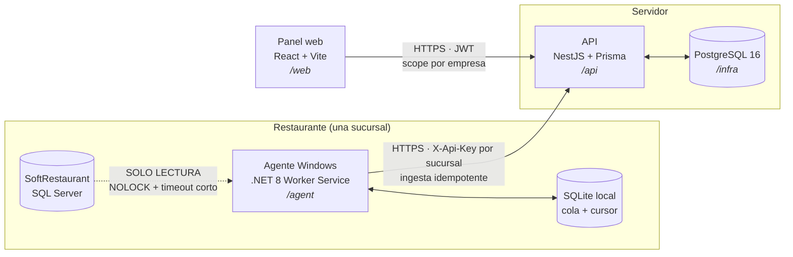

# Monitor para SoftRestaurant

Panel de monitoreo para restaurantes que operan con **SoftRestaurant**. Un agente
instalado en la máquina del restaurante **lee** su base de SQL Server, manda lo que
encuentra a un API propio, y un panel web muestra ventas, mesas abiertas y reportes
por empresa y sucursal.

> **La regla que manda sobre todas.** La base de SoftRestaurant es **de solo lectura**.
> Ni un `INSERT`, ni un `UPDATE`, ni un `DELETE`, ni una tabla auxiliar "sólo para el
> cursor". El POS es el sistema del que vive el restaurante y no es nuestro: si nuestro
> código lo rompe, el negocio no puede cobrar. El estado propio del agente vive en su
> SQLite local. Las demás reglas innegociables están en [`CLAUDE.md`](CLAUDE.md).

## Arquitectura



Lo que importa de ese dibujo:

- **La flecha del POS al agente es de un solo sentido.** Nunca se invierte.
- **El agente no manda IDs de tenant.** La sucursal se resuelve desde la API key en el
  guard del API. Un agente comprometido no puede escribir en los datos de otra empresa.
- **La ingesta es idempotente.** Upsert por `(sucursal_id, folio_sr)` con constraint
  único en base: reenviar el mismo lote tres veces deja exactamente los mismos datos.
- **Los cortes de "hoy" se calculan en la zona de la sucursal**, no en la del servidor.
  En base todo es UTC.

## Los carriles

| Carpeta | Qué es | Stack |
|---|---|---|
| [`/agent`](agent) | Servicio de Windows que lee SoftRestaurant y envía al API | .NET 8 Worker Service |
| [`/api`](api) | Ingesta del agente + lectura para el panel | NestJS 11 + Prisma + Postgres |
| [`/web`](web) | Panel web | React 18 + Vite + TypeScript |
| [`/infra`](infra) | Postgres local (dev) y, más adelante, el compose de producción | Docker Compose |
| [`/docs`](docs) | [Esquema real de SoftRestaurant](docs/esquema-sr.md) y log del modo autónomo | — |

`/api` y `/web` son **workspaces de npm**: se instalan juntos desde la raíz y comparten
un único `package-lock.json`. El CI cuenta con eso.

## Levantar todo en local

Los comandos de esta sección están escritos para **PowerShell 5.1** (el que trae
Windows) y se copian **tal cual, uno por línea**. No usan `&&`: PowerShell 5.1 no lo
acepta como separador. La corrida real de esta misma secuencia en un clon limpio, con su
salida, está en [`docs/verificacion-arranque.md`](docs/verificacion-arranque.md).

### Requisitos

| Herramienta | Versión | Para qué |
|---|---|---|
| Node | 22 o superior | `/api` y `/web` |
| .NET SDK | 8.x | `/agent` |
| Docker | cualquiera reciente | el Postgres de `/infra` |

> **Si PowerShell dice `npm.ps1 ... la ejecución de scripts está deshabilitada`**, es la
> política de ejecución de Windows, no el repo. Dos salidas, elige una:
>
> - Una vez por consola (sólo afecta a esa ventana, no cambia nada del sistema):
>
>   ```powershell
>   Set-ExecutionPolicy -Scope Process Bypass -Force
>   ```
>
> - O escribe `npm.cmd` y `npx.cmd` en lugar de `npm` y `npx` en cada comando de abajo.
>   Hacen lo mismo y no pasan por la política.

### 1 · Postgres

```powershell
cd infra
docker compose up -d
cd ..
```

Levanta un `postgres:16` **vacío** en el puerto 5432, con usuario/contraseña/base
`monitor` por defecto. Para cambiarlos, copia `infra/.env.example` a `infra/.env`.
El esquema lo crea Prisma en el paso 3.

**Sin Docker** (máquina sin virtualización, por ejemplo): sirve un PostgreSQL 16 nativo
en el 5432 con un rol `monitor`/`monitor` que tenga `CREATEDB` (`prisma migrate dev` crea
y borra una *shadow database*) y una base `monitor` de su propiedad.

Para tirarlo y borrar los datos: `docker compose down -v` (desde `infra`).

### 2 · Dependencias de Node

Desde la **raíz** del repo (instala `/api` y `/web` de una vez):

```powershell
npm ci
```

Eso **también genera el cliente de Prisma**: `api/package.json` tiene un `postinstall`
que corre `prisma generate` (F2-200). No hace falta correrlo a mano. Si alguna vez ves
`Namespace 'Prisma' has no exported member 'Decimal'` (y cien errores más), el cliente
quedó vacío: corre `npm run postinstall` en `/api` y averigua quién quitó el script (un
test de contrato, `api/scripts/instalacion.spec.ts`, falla si falta).

npm 11 imprime `npm warn allow-scripts` si un paquete con scripts de instalación no está
en el campo `allowScripts` del `package.json` raíz. **Hoy ese aviso no bloquea nada**, y
no era la causa del cliente vacío (ver *Notas de dependencias*). El campo ya aprueba los
que hacen falta; si subes de versión uno de ellos, vuelve a aprobarlo con
`npm approve-scripts <paquete>` desde la raíz.

### 3 · API

```powershell
cd api
npm run setup:env
npx prisma migrate deploy
npm run seed
npm run dev
```

Qué hace cada uno:

- **`npm run setup:env`** copia `api/.env.example` a `api/.env` si no existe. Si ya
  existe **no lo toca** y lo avisa. Ajusta `DATABASE_URL` si cambiaste algo en
  `infra/.env`.
- **`npx prisma migrate deploy`** aplica las migraciones a la base (no pregunta nada).
  Quien crea migraciones nuevas usa `npx prisma migrate dev`.
- **`npm run seed`** corre los tres seeds en su orden: `prisma db seed` (1 admin global,
  1 empresa demo, 2 sucursales), `seed:ventas` (500 cheques sintéticos, 2 sucursales ×
  30 días hasta hoy) y `seed:mesas` (mesas abiertas del Monitor, "en vivo" durante
  90 s: para volver a verlas vivas, `npm run seed:mesas` otra vez). Los tres son
  idempotentes: correrlos otra vez no duplica nada.
- **`npm run dev`** levanta la API en `http://localhost:3000` y se queda corriendo. Desde
  la raíz, `npm run dev:api` hace lo mismo.

El seed crea `admin@monitor.local` con la contraseña de `SEED_ADMIN_PASSWORD` (o la de
desarrollo por defecto, con aviso en consola).

La API no arranca sin `JWT_ACCESS_SECRET` y `JWT_REFRESH_SECRET` (al menos 32 caracteres
y distintos entre sí). `api/.env.example` trae unos de relleno para local y el comando
para generar los tuyos. Si tu `api/.env` es anterior a F1-011, agrégaselos.

> **Quién lee `api/.env`.** No hay `dotenv` ni `ConfigModule`: tanto la CLI de Prisma
> como la API en marcha reciben esas variables porque **el cliente de Prisma carga
> `api/.env` solo** al importarse. Una variable que ya exista en el entorno gana sobre
> la del archivo (así se puede cambiar `PORT` o `DATABASE_URL` para una corrida sin
> editar `.env`).

Los tests de `/api` (`npm test`) corren en serie contra el Postgres de `DATABASE_URL`: en
local es tu base de desarrollo, a la que sólo le escriben el seed (idempotente) y fixtures
sintéticas (empresas, sucursales y usuarios `@f1-011.test`) que borran al terminar. Sin
base, fallan; no se saltan.

El contrato de la API es `api/openapi.json`. Si cambias un endpoint o un DTO, corre
`npm run openapi` en `/api` y commitea el resultado: un test falla si no coincide.

### 4 · Panel web

En **otra** consola (la del paso 3 se queda con la API), desde la raíz del repo:

```powershell
if (-not (Test-Path web\.env.local)) { Copy-Item web\.env.example web\.env.local }
npm run dev:web
```

La primera línea es opcional (los valores por defecto ya sirven en local) y no pisa un
`web\.env.local` que ya tengas.

Queda en `http://localhost:5173`, con la API del paso 3 corriendo detrás. Entra con el
admin global del seed.

La SPA habla con la API **siempre en el mismo origen, bajo `/api`**. En local lo resuelve
el proxy de Vite (`web/vite.config.ts`): quita el prefijo `/api`, manda a
`API_PROXY_TARGET` (por defecto `http://localhost:3000`) y reescribe el `Path` de la cookie
de refresh de `/auth` a `/api/auth`. Así no hace falta CORS con credenciales y la cookie
`HttpOnly; SameSite=Strict` viaja sola a `/api/auth/refresh`.

> **Producción (F1-002):** Caddy tiene que hacer lo mismo: `handle_path /api/*` hacia la
> API y reescribir el `Path=/auth` del `Set-Cookie` a `Path=/api/auth`. Sin eso el login
> funciona pero el refresh silencioso no, y cada recarga pide contraseña. **Ya está escrito**
> en los snippets de [`infra/caddy/seguridad.caddy`](infra/caddy/seguridad.caddy) (F1-092),
> junto con las cabeceras de seguridad (HSTS, CSP estricta de la SPA), la compresión y la
> caché de los assets: el Caddyfile de F1-002 sólo los importa. La API detrás de Caddy
> arranca con `TRUST_PROXY_SALTOS=1` (ver `api/.env.example`), o el rate limit del login
> cuenta a todos los usuarios como una sola IP.
>
> Para probarlo en local (con la API en :3000 y `npm run build` hecho en `/web`), desde la
> raíz: `caddy run --config infra/caddy/Caddyfile.local --adapter caddyfile` y abre
> `http://localhost:8080`.

El color de acento se configura con `VITE_COLOR_ACENTO` (hex); ver `web/.env.example`.

### 5 · Agente

```powershell
cd agent
dotnet build --configuration Release
```

Todavía no lee nada: es el esqueleto del Worker Service. La configuración real
(`config.json`, instalación con `sc create`, publicación single-file) llega en F1-020.

## Comandos por carril

| Carril | Lint | Tipos | Tests | Build |
|---|---|---|---|---|
| `/api` | `npm run lint -w @monitor/api` | `npm run typecheck -w @monitor/api` | `npm test -w @monitor/api` | `npm run build -w @monitor/api` |
| `/web` | `npm run lint -w @monitor/web` | (va dentro del build: `tsc -b`) | `npm test -w @monitor/web` | `npm run build -w @monitor/web` + `npm run check:bundle -w @monitor/web` (tope 400 kB gzip) |
| `/agent` | `dotnet format` | — | `dotnet test` (desde F1-021) | `dotnet build -c Release` |

Desde la raíz, `npm run lint`, `npm run typecheck`, `npm test` y `npm run build` corren
el script correspondiente en los workspaces que lo tengan.

Formato: `npm run format` (prettier). Sólo toca `/api` y `/web`; `scripts/`, `.github/`,
`/agent` y `docs/` están fuera a propósito — ver [`.prettierignore`](.prettierignore).

## El CI

[`.github/workflows/ci.yml`](.github/workflows/ci.yml) tiene cuatro jobs:

- **`guardia`** — corre desde el commit inicial. Falla si se cuela un centinela del
  orquestador nocturno, un secreto versionado (`.env`, `.pem`, `.key`, `config.json`) o
  si el hook `pre-push` pierde sus finales LF.
- **`api`**, **`web`**, **`agent`** — activos desde F1-001: lint, typecheck y build.

Los pasos de **test** se encienden con la tarea que los habilita: F1-011 encendió el de
`api` (con su servicio de postgres) y F1-040 el de `web`. Sigue comentado el de `agent`,
que enciende F1-021.
Encender un carril es parte del entregable de la tarea que lo habilita.

## Notas de dependencias

- **`/api` va en NestJS 11 a propósito, no en 12.** Nest 12 es ESM puro, y pasar el
  carril entero a ESM en la primera tarea arrastra a Prisma, a jest y a los decoradores
  sin que nada lo pida. Se revisa cuando haya una razón concreta.
- **`overrides.multer` en el `package.json` raíz.** `@nestjs/platform-express@11` fija
  `multer@2.2.0`, que tiene cuatro avisos de severidad alta (DoS por nombres de campo,
  fuga de descriptores en subidas abortadas, bypass del límite de tamaño). El override
  lo sube a `2.4.0`, que los corrige sin cambiar la API.
  `npm ls multer` marca *invalid* porque el pin de Nest dice 2.2.0: es el ruido esperado
  de un override, no un problema. Se quita cuando `/api` pase a Nest 12.
- **`npm audit` ya no queda en cero: 3 avisos altos que son uno solo, y se quedan.** Es
  `deepmerge-ts <8` (GHSA-ggr8-5vv4-36mx, recursión sin tope al fusionar objetos
  cíclicos), por `prisma@6.19.3 → @prisma/config@6.19.3 → deepmerge-ts@7.1.5`, con la
  versión **fijada exacta** por Prisma. Todas las `@prisma/config` 6.x, y la `latest`
  (7.1.5 también), la fijan igual. `npm audit fix --force` "lo arregla" bajando `prisma` a
  6.12.0, que rompe. Un `overrides` a `8.0.2` (global o con alcance `@prisma/config`, con
  rango o exacto) **no funciona con npm 11.17**: o no lo aplica, o saca `deepmerge-ts` del
  lock y entonces `prisma` truena con `ERR_MODULE_NOT_FOUND`. El riesgo real es bajo: sólo
  la usa la CLI de Prisma para fusionar **su propia config**, en desarrollo; nada de
  entrada de usuarios y nada en la API en marcha. Se cierra al subir a Prisma 7 (F2-200,
  detalle en `docs/nocturno-log.md`).
- **`package.json#prisma` (el `seed`) sigue ahí, aunque Prisma avise que se depreca en
  Prisma 7.** Migrarlo a `prisma.config.ts` **no es directo**: con un archivo de config,
  Prisma 6 **deja de cargar `api/.env`** (`prisma validate` falla en `getConfig`), y hoy la
  API entera recibe sus variables por esa carga (ver *Quién lee `api/.env`*, arriba).
  Se hace junto con la subida a Prisma 7, poniendo antes una carga explícita del `.env`.
- **El `postinstall` de `/api` (`prisma generate`) y el cliente vacío.** El
  `postinstall` propio de `@prisma/client` corre con el cwd en la **raíz** del monorepo,
  busca ahí `prisma/schema.prisma`, no lo encuentra (vive en `api/prisma/`) y deja un
  cliente **vacío** (`PrismaClient: any`). No es que npm bloquee los scripts: en npm
  11.17 `allowScripts` sólo avisa, y los scripts corren. Por eso el arreglo es el
  `postinstall` del workspace y no tocar `allowScripts`. Ojo con un futuro
  `npm ci --omit=dev` (un Dockerfile de producción, por ejemplo): `prisma` es
  devDependency y ese `postinstall` fallaría; ahí el cliente se genera en la etapa de
  build, con las devDependencies puestas.
- **`allowScripts` en el `package.json` raíz.** Aprueba, fijados a su versión, los
  scripts de instalación de `prisma`, `@prisma/client`, `@prisma/engines`,
  `@parcel/watcher` y `unrs-resolver`, y niega el de `@scarf/scarf` (telemetría de
  swagger-ui). Hoy sólo apaga el aviso; está para cuando npm empiece a bloquear los no
  revisados. Al subir de versión uno de ellos, `npm approve-scripts <paquete>` desde la
  raíz reescribe su entrada. npm 10 (el del CI con Node 22) ignora el campo.

## Cómo se trabaja en este repo

El protocolo está en [`CLAUDE.md`](CLAUDE.md) y el orden de las tareas lo manda la
**Cola nocturna** de [`backlog.md`](backlog.md). La instalación del kit desde cero está
en [`0-INSTALACION.md`](0-INSTALACION.md).
