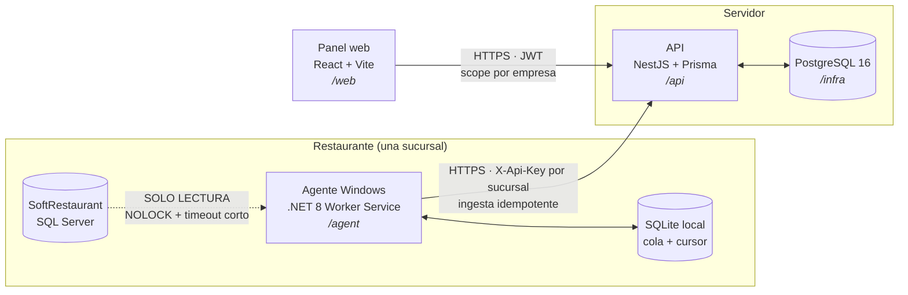

# Monitor para SoftRestaurant

Panel de monitoreo para restaurantes que operan con **SoftRestaurant**. Un agente
instalado en la máquina del restaurante **lee** su base de SQL Server, manda lo que
encuentra a un API propio, y un panel web muestra ventas, mesas abiertas y reportes
por empresa y sucursal.

> **La regla que manda sobre todas.** La base de SoftRestaurant es **de solo lectura**.
> Ni un `INSERT`, ni un `UPDATE`, ni un `DELETE`, ni una tabla auxiliar "sólo para el
> cursor". El POS es el sistema del que vive el restaurante y no es nuestro: si nuestro
> código lo rompe, el negocio no puede cobrar. El estado propio del agente vive en su
> SQLite local. Las demás reglas innegociables están en [`CLAUDE.md`](CLAUDE.md).

## Arquitectura



Lo que importa de ese dibujo:

- **La flecha del POS al agente es de un solo sentido.** Nunca se invierte.
- **El agente no manda IDs de tenant.** La sucursal se resuelve desde la API key en el
  guard del API. Un agente comprometido no puede escribir en los datos de otra empresa.
- **La ingesta es idempotente.** Upsert por `(sucursal_id, folio_sr)` con constraint
  único en base: reenviar el mismo lote tres veces deja exactamente los mismos datos.
- **Los cortes de "hoy" se calculan en la zona de la sucursal**, no en la del servidor.
  En base todo es UTC.

## Los carriles

| Carpeta | Qué es | Stack |
|---|---|---|
| [`/agent`](agent) | Servicio de Windows que lee SoftRestaurant y envía al API | .NET 8 Worker Service |
| [`/api`](api) | Ingesta del agente + lectura para el panel | NestJS 11 + Prisma + Postgres |
| [`/web`](web) | Panel web | React 18 + Vite + TypeScript |
| [`/infra`](infra) | Postgres local (dev) y, más adelante, el compose de producción | Docker Compose |
| [`/docs`](docs) | [Esquema real de SoftRestaurant](docs/esquema-sr.md) y log del modo autónomo | — |

`/api` y `/web` son **workspaces de npm**: se instalan juntos desde la raíz y comparten
un único `package-lock.json`. El CI cuenta con eso.

## Levantar todo en local

### Requisitos

| Herramienta | Versión | Para qué |
|---|---|---|
| Node | 22 o superior | `/api` y `/web` |
| .NET SDK | 8.x | `/agent` |
| Docker | cualquiera reciente | el Postgres de `/infra` |

### 1 · Postgres

```bash
cd infra
docker compose up -d
```

Levanta un `postgres:16` **vacío** en el puerto 5432, con usuario/contraseña/base
`monitor` por defecto. Para cambiarlos, copia `infra/.env.example` a `infra/.env`.
El esquema lo crea Prisma en el paso 3.

**Sin Docker** (máquina sin virtualización, por ejemplo): sirve un PostgreSQL 16 nativo
en el 5432 con un rol `monitor`/`monitor` que tenga `CREATEDB` (`prisma migrate dev` crea
y borra una *shadow database*) y una base `monitor` de su propiedad.

Para tirarlo y borrar los datos: `docker compose down -v`.

### 2 · Dependencias de Node

Desde la **raíz** del repo (instala `/api` y `/web` de una vez):

```bash
npm install
```

### 3 · API

```bash
cp api/.env.example api/.env   # ajusta DATABASE_URL si cambiaste algo en infra/.env
cd api
npx prisma migrate dev         # aplica las migraciones y genera el cliente
npx prisma db seed             # 1 admin global, 1 empresa demo, 2 sucursales (idempotente)
cd ..
npm run dev:api                # o: npm run dev --workspace @monitor/api
```

El seed crea `admin@monitor.local` con la contraseña de `SEED_ADMIN_PASSWORD` (o la de
desarrollo por defecto, con aviso en consola). Correrlo otra vez no cambia nada.

La API no arranca sin `JWT_ACCESS_SECRET` y `JWT_REFRESH_SECRET` (al menos 32 caracteres
y distintos entre sí). `api/.env.example` trae unos de relleno para local y el comando
para generar los tuyos. Si tu `api/.env` es anterior a F1-011, agrégaselos.

Los tests de `/api` (`npm test`) corren en serie contra el Postgres de `DATABASE_URL`: en
local es tu base de desarrollo, a la que sólo le escriben el seed (idempotente) y fixtures
sintéticas (empresas, sucursales y usuarios `@f1-011.test`) que borran al terminar. Sin
base, fallan; no se saltan.

El contrato de la API es `api/openapi.json`. Si cambias un endpoint o un DTO, corre
`npm run openapi` en `/api` y commitea el resultado: un test falla si no coincide.

Queda escuchando en `http://localhost:3000`.

### 4 · Panel web

```bash
cp web/.env.example web/.env.local
npm run dev:web                # o: npm run dev --workspace @monitor/web
```

Queda en `http://localhost:5173`.

### 5 · Agente

```bash
cd agent
dotnet build --configuration Release
```

Todavía no lee nada: es el esqueleto del Worker Service. La configuración real
(`config.json`, instalación con `sc create`, publicación single-file) llega en F1-020.

## Comandos por carril

| Carril | Lint | Tipos | Tests | Build |
|---|---|---|---|---|
| `/api` | `npm run lint -w @monitor/api` | `npm run typecheck -w @monitor/api` | `npm test -w @monitor/api` | `npm run build -w @monitor/api` |
| `/web` | `npm run lint -w @monitor/web` | (va dentro del build: `tsc -b`) | `npm test -w @monitor/web` | `npm run build -w @monitor/web` |
| `/agent` | `dotnet format` | — | `dotnet test` (desde F1-021) | `dotnet build -c Release` |

Desde la raíz, `npm run lint`, `npm run typecheck`, `npm test` y `npm run build` corren
el script correspondiente en los workspaces que lo tengan.

Formato: `npm run format` (prettier). Sólo toca `/api` y `/web`; `scripts/`, `.github/`,
`/agent` y `docs/` están fuera a propósito — ver [`.prettierignore`](.prettierignore).

## El CI

[`.github/workflows/ci.yml`](.github/workflows/ci.yml) tiene cuatro jobs:

- **`guardia`** — corre desde el commit inicial. Falla si se cuela un centinela del
  orquestador nocturno, un secreto versionado (`.env`, `.pem`, `.key`, `config.json`) o
  si el hook `pre-push` pierde sus finales LF.
- **`api`**, **`web`**, **`agent`** — activos desde F1-001: lint, typecheck y build.

Los pasos de **test** siguen comentados, cada uno con la tarea que lo enciende anotada
encima: F1-011 (api, con su servicio de postgres), F1-041 (web) y F1-021 (agent).
Encender un carril es parte del entregable de la tarea que lo habilita.

## Notas de dependencias

- **`/api` va en NestJS 11 a propósito, no en 12.** Nest 12 es ESM puro, y pasar el
  carril entero a ESM en la primera tarea arrastra a Prisma, a jest y a los decoradores
  sin que nada lo pida. Se revisa cuando haya una razón concreta.
- **`overrides.multer` en el `package.json` raíz.** `@nestjs/platform-express@11` fija
  `multer@2.2.0`, que tiene cuatro avisos de severidad alta (DoS por nombres de campo,
  fuga de descriptores en subidas abortadas, bypass del límite de tamaño). El override
  lo sube a `2.4.0`, que los corrige sin cambiar la API. `npm audit` queda en cero.
  `npm ls multer` marca *invalid* porque el pin de Nest dice 2.2.0: es el ruido esperado
  de un override, no un problema. Se quita cuando `/api` pase a Nest 12.

## Cómo se trabaja en este repo

El protocolo está en [`CLAUDE.md`](CLAUDE.md) y el orden de las tareas lo manda la
**Cola nocturna** de [`backlog.md`](backlog.md). La instalación del kit desde cero está
en [`0-INSTALACION.md`](0-INSTALACION.md).
